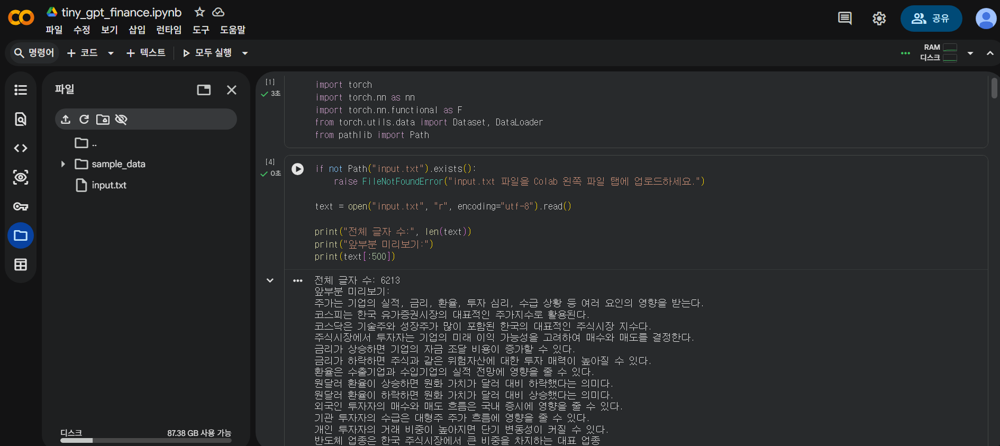
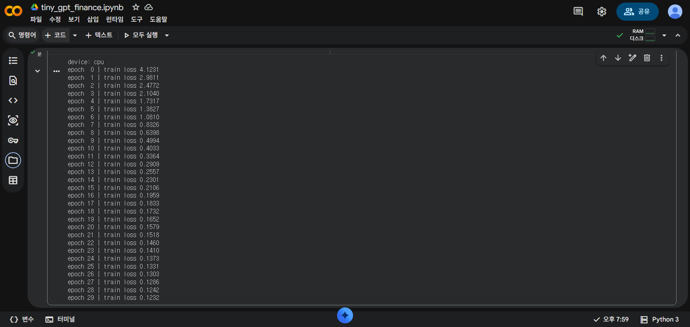
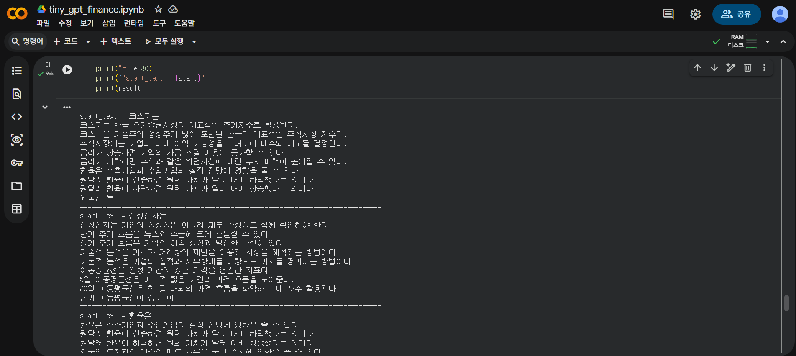

# Tiny GPT를 이용한 한국어 금융 문장 생성 실험

## 프로젝트 개요

이 프로젝트는 TinyGPT 구조를 이용해 한국어 금융 문장 데이터셋을 학습시키고, 학습된 모델이 금융 문장 스타일의 텍스트를 생성할 수 있는지 확인한 실험이다.

기본 실습 코드에서는 Tiny Shakespeare 데이터를 사용했지만, 이 프로젝트에서는 직접 만든 한국어 금융 문장 데이터셋 `input.txt`를 사용했다. 데이터셋에는 주식시장, 코스피, 코스닥, 환율, 금리, 이동평균선, 투자 전략, 언어모델 관련 문장들을 넣었다.

이 모델은 실제 ChatGPT처럼 질문에 답하는 대규모 언어모델은 아니다. 글자 하나하나를 토큰으로 보고, 앞에 나온 글자들을 바탕으로 다음 글자를 예측하는 작은 문자 단위 GPT 모델이다. 따라서 모델은 문장의 의미를 깊게 이해한다기보다는, 학습 데이터에 나타난 문자 패턴과 문체를 학습하여 비슷한 형태의 문장을 생성한다.

---

## 파일 구성

```text
tiny-gpt-finance/
├─ tiny_gpt_finance.ipynb
├─ input.txt
├─ generated_samples.txt
├─ images/
│  ├─ file_upload.png
│  ├─ loss_result.png
│  └─ generated_result.png
└─ README.md
```

| 파일 | 설명 |
|---|---|
| `tiny_gpt_finance.ipynb` | TinyGPT 모델 구현, 학습, 문장 생성 과정이 들어 있는 Colab 노트북 |
| `input.txt` | 직접 구성한 한국어 금융 문장 학습 데이터셋 |
| `generated_samples.txt` | 학습 후 모델이 생성한 문장 결과 |
| `images/` | Colab 실행 화면 캡처 이미지 |
| `README.md` | 프로젝트 설명, 코드 구조, 실행 결과 정리 |

---

## 실행 방법

1. Google Colab에서 `tiny_gpt_finance.ipynb`를 연다.
2. Colab 왼쪽 파일 탭에 `input.txt`를 업로드한다.
3. 노트북의 셀을 위에서부터 순서대로 실행한다.
4. 학습이 끝나면 train loss가 출력된다.
5. 마지막 생성 셀을 실행하면 `코스피는`, `삼성전자는`, `환율은`, `투자자는`으로 시작하는 문장이 생성된다.
6. 생성 결과는 `generated_samples.txt` 파일로 저장된다.

---

## 사용한 라이브러리

```python
import torch
import torch.nn as nn
import torch.nn.functional as F
from torch.utils.data import Dataset, DataLoader
from pathlib import Path
```

`torch`는 텐서 연산과 딥러닝 모델 학습에 사용했다.  
`torch.nn`은 신경망 계층을 정의하는 데 사용했고, `torch.nn.functional`은 softmax, cross entropy 같은 함수를 사용하기 위해 불러왔다.  
`Dataset`과 `DataLoader`는 텍스트 데이터를 학습 가능한 batch 형태로 만들기 위해 사용했다.  
`Path`는 Colab 환경에서 `input.txt` 파일이 존재하는지 확인하기 위해 사용했다.

---

## 데이터셋 구성

`input.txt`는 한국어 금융 문장으로 구성했다. 예시는 다음과 같다.

```text
코스피는 한국 유가증권시장의 대표적인 주가지수로 활용된다.
환율은 수출기업과 수입기업의 실적 전망에 영향을 줄 수 있다.
이동평균선은 일정 기간의 평균 가격을 연결한 지표다.
```

이 프로젝트에서는 금융시장, 주가, 환율, 금리, 이동평균선, 투자 전략, 언어모델 관련 문장들을 하나의 텍스트 파일로 만들었다. 모델 구조는 기존 TinyGPT 실습 코드와 비슷하게 유지하되, 데이터셋을 영어 희곡 데이터가 아니라 한국어 금융 문장으로 바꾸어 실험했다.

이렇게 한 이유는 같은 모델 구조라도 어떤 데이터셋을 넣느냐에 따라 생성 결과가 달라지는지 확인하기 위해서다.

---

## 텍스트 불러오기

데이터셋은 다음 코드로 불러왔다.

```python
if not Path("input.txt").exists():
    raise FileNotFoundError("input.txt 파일을 먼저 업로드하세요.")

text = open("input.txt", "r", encoding="utf-8").read()
```

이 코드는 Colab 환경에 `input.txt` 파일이 있는지 확인한 뒤, 파일 전체를 하나의 문자열로 읽어온다.  
인터넷에서 데이터를 자동으로 다운로드하지 않고, 직접 만든 `input.txt`를 업로드해서 사용했다.

---

## 문자 사전 만들기

텍스트를 모델에 넣기 위해서는 글자를 숫자로 바꾸어야 한다. 이를 위해 다음 코드를 사용했다.

```python
chars = sorted(list(set(text)))

stoi = {ch: i for i, ch in enumerate(chars)}
itos = {i: ch for ch, i in stoi.items()}

vocab_size = len(chars)

data = torch.tensor([stoi[ch] for ch in text], dtype=torch.long)
```

`chars`는 데이터셋에 등장하는 고유한 글자 목록이다.  
`stoi`는 string to integer의 의미로, 글자를 숫자로 바꾸는 사전이다.  
`itos`는 integer to string의 의미로, 숫자를 다시 글자로 바꾸는 사전이다.

예를 들어 어떤 한글 글자 `코`가 숫자 15로 매핑되었다면, 모델은 실제 글자 `코`를 직접 입력받는 것이 아니라 숫자 15를 입력받는다. 이후 이 숫자는 embedding layer를 통해 벡터로 변환된다.

이 프로젝트에서는 단어 단위 토큰화가 아니라 글자 하나하나를 토큰으로 사용했다. 한국어는 한 글자 자체가 어느 정도 의미를 가지는 경우도 있기 때문에, 글자 단위 학습 실험에 적합하다고 판단했다.

---

## NextTokenDataset

다음 글자 예측 학습을 위해 `NextTokenDataset` 클래스를 만들었다.

```python
class NextTokenDataset(Dataset):
    def __init__(self, data, block_size):
        self.data = data
        self.block_size = block_size

    def __len__(self):
        return len(self.data) - self.block_size

    def __getitem__(self, idx):
        x = self.data[idx : idx + self.block_size]
        y = self.data[idx + 1 : idx + self.block_size + 1]
        return x, y
```

이 클래스는 긴 텍스트를 일정 길이의 조각으로 잘라서 입력 `x`와 정답 `y`를 만든다.  
`x`는 모델이 보는 입력이고, `y`는 모델이 맞혀야 하는 다음 글자들이다.  
`y`는 `x`보다 한 글자 뒤로 밀려 있다.

예를 들어 텍스트가 다음과 같다고 하면,

```text
코스피는 상승했다
```

모델은 다음과 같은 방식으로 학습한다.

```text
입력 x: 코스피는 상승했
정답 y: 스피는 상승했다
```

즉, 앞 글자들을 보고 다음 글자를 예측하도록 학습된다. 이것이 GPT 스타일 언어모델의 기본적인 학습 방식이다.

---

## DataLoader 설정

데이터셋은 다음과 같이 설정했다.

```python
block_size = 64
dataset = NextTokenDataset(data, block_size)
loader = DataLoader(dataset, batch_size=64, shuffle=True)
```

`block_size`는 모델이 한 번에 볼 수 있는 글자 길이를 의미한다.  
이 프로젝트에서는 64글자씩 잘라서 학습했다.

`batch_size=64`는 한 번의 학습 단계에서 64개의 문장 조각을 동시에 사용한다는 의미이다.  
`shuffle=True`는 학습 데이터의 순서를 섞어 모델이 특정 순서만 외우는 것을 줄이기 위해 사용했다.

---

## Head 클래스: masked self-attention

`Head` 클래스는 하나의 masked self-attention head를 구현한 부분이다.

```python
class Head(nn.Module):
    def __init__(self, emb_dim, head_size, block_size, dropout=0.1):
        super().__init__()

        self.key = nn.Linear(emb_dim, head_size, bias=False)
        self.query = nn.Linear(emb_dim, head_size, bias=False)
        self.value = nn.Linear(emb_dim, head_size, bias=False)

        self.register_buffer("tril", torch.tril(torch.ones(block_size, block_size)))
        self.dropout = nn.Dropout(dropout)

    def forward(self, x):
        B, T, C = x.shape

        k = self.key(x)
        q = self.query(x)
        v = self.value(x)

        wei = q @ k.transpose(-2, -1) * (k.size(-1) ** -0.5)

        wei = wei.masked_fill(self.tril[:T, :T] == 0, float("-inf"))

        wei = F.softmax(wei, dim=-1)
        wei = self.dropout(wei)

        out = wei @ v
        return out
```

self-attention에서는 각 위치의 입력을 query, key, value로 변환한다.

| 이름 | 의미 |
|---|---|
| Query | 현재 위치가 어떤 정보를 찾고 있는지 나타냄 |
| Key | 각 위치가 어떤 정보를 가지고 있는지 나타냄 |
| Value | 실제로 전달될 정보 |

다음 코드는 attention score를 계산하는 부분이다.

```python
wei = q @ k.transpose(-2, -1) * (k.size(-1) ** -0.5)
```

query와 key의 내적을 통해 각 글자 위치가 다른 글자 위치를 얼마나 참고할지 계산한다. 여기에 scaling을 적용하여 softmax가 너무 한쪽으로 치우치는 것을 줄인다.

다음 코드는 미래 글자를 보지 못하게 막는 부분이다.

```python
wei = wei.masked_fill(self.tril[:T, :T] == 0, float("-inf"))
```

GPT는 다음 글자를 예측하는 auto-regressive 모델이다. 따라서 현재 위치에서 미래 글자를 미리 보면 안 된다. 이 코드는 lower triangular mask를 사용하여 현재 위치 이전의 글자들만 참고할 수 있도록 만든다.

---

## MultiHeadAttention

`MultiHeadAttention`은 여러 개의 attention head를 병렬로 실행한 뒤 결과를 합치는 구조이다.

```python
class MultiHeadAttention(nn.Module):
    def __init__(self, emb_dim, num_heads, block_size, dropout=0.1):
        super().__init__()

        head_size = emb_dim // num_heads

        self.heads = nn.ModuleList([
            Head(emb_dim, head_size, block_size, dropout)
            for _ in range(num_heads)
        ])

        self.proj = nn.Linear(emb_dim, emb_dim)
        self.dropout = nn.Dropout(dropout)

    def forward(self, x):
        out = torch.cat([h(x) for h in self.heads], dim=-1)
        out = self.proj(out)
        out = self.dropout(out)
        return out
```

하나의 attention head만 사용하면 한 가지 관점에서만 앞 문맥을 보게 된다. 여러 개의 head를 사용하면 각 head가 서로 다른 방식으로 글자 간 관계를 학습할 수 있다.

예를 들어 어떤 head는 금융 용어의 반복 패턴을 볼 수 있고, 다른 head는 문장 끝 표현이나 조사 패턴을 볼 수 있다. 이처럼 multi-head attention은 여러 attention head를 병렬로 사용해 더 다양한 문맥 정보를 학습하도록 만든 구조이다.

---

## FeedForward

`FeedForward`는 attention 결과를 다시 비선형 변환하는 신경망이다.

```python
class FeedForward(nn.Module):
    def __init__(self, emb_dim, dropout=0.1):
        super().__init__()

        self.net = nn.Sequential(
            nn.Linear(emb_dim, 4 * emb_dim),
            nn.ReLU(),
            nn.Linear(4 * emb_dim, emb_dim),
            nn.Dropout(dropout),
        )

    def forward(self, x):
        return self.net(x)
```

구조는 다음과 같다.

```text
Linear
→ ReLU
→ Linear
→ Dropout
```

첫 번째 Linear layer에서 차원을 `4 * emb_dim`으로 키운 뒤, 다시 `emb_dim`으로 줄인다. 이를 통해 attention을 통해 얻은 표현을 한 번 더 가공하고, 모델의 표현력을 높인다.

---

## Block 클래스

`Block`은 TinyGPT의 기본 단위이다.

```python
class Block(nn.Module):
    def __init__(self, emb_dim, num_heads, block_size, dropout=0.1):
        super().__init__()

        self.ln1 = nn.LayerNorm(emb_dim)
        self.sa = MultiHeadAttention(emb_dim, num_heads, block_size, dropout)

        self.ln2 = nn.LayerNorm(emb_dim)
        self.ffwd = FeedForward(emb_dim, dropout)

    def forward(self, x):
        x = x + self.sa(self.ln1(x))
        x = x + self.ffwd(self.ln2(x))
        return x
```

하나의 block은 다음 요소들로 구성된다.

```text
LayerNorm
→ MultiHeadAttention
→ Residual Connection
→ LayerNorm
→ FeedForward
→ Residual Connection
```

다음 부분이 residual connection이다.

```python
x = x + self.sa(self.ln1(x))
x = x + self.ffwd(self.ln2(x))
```

residual connection은 기존 입력 `x`에 attention 결과와 feedforward 결과를 더하는 방식이다. 이 구조는 깊은 모델에서 정보가 사라지는 것을 줄이고, 학습을 더 안정적으로 만드는 데 도움을 준다.

`LayerNorm`은 각 층의 입력 분포를 안정화하는 역할을 한다. 이 모델에서는 attention 전에 한 번, feedforward 전에 한 번 layer normalization을 적용했다.

---

## TinyGPT 클래스

`TinyGPT`는 전체 모델을 정의하는 클래스이다.

```python
class TinyGPT(nn.Module):
    def __init__(
        self,
        vocab_size,
        block_size,
        emb_dim=128,
        num_heads=4,
        num_layers=4,
        dropout=0.1
    ):
        super().__init__()

        self.block_size = block_size

        self.token_embedding = nn.Embedding(vocab_size, emb_dim)
        self.position_embedding = nn.Embedding(block_size, emb_dim)

        self.blocks = nn.Sequential(*[
            Block(emb_dim, num_heads, block_size, dropout)
            for _ in range(num_layers)
        ])

        self.ln_f = nn.LayerNorm(emb_dim)
        self.lm_head = nn.Linear(emb_dim, vocab_size)

    def forward(self, x):
        B, T = x.shape

        pos = torch.arange(T, device=x.device)

        tok = self.token_embedding(x)
        pos = self.position_embedding(pos)[None, :, :]

        h = tok + pos
        h = self.blocks(h)
        h = self.ln_f(h)

        logits = self.lm_head(h)

        return logits
```

TinyGPT는 크게 다음 요소들로 구성된다.

| 구성 요소 | 역할 |
|---|---|
| `token_embedding` | 글자 번호를 벡터로 변환 |
| `position_embedding` | 글자의 위치 정보를 벡터로 변환 |
| `blocks` | 여러 개의 Transformer block |
| `ln_f` | 최종 layer normalization |
| `lm_head` | 각 위치에서 다음 글자 후보 점수 출력 |

`token_embedding`은 글자 번호를 벡터로 바꾸는 역할을 한다. 예를 들어 어떤 글자가 숫자 15로 변환되었다면, 모델은 이 숫자를 바로 계산에 사용하는 것이 아니라 학습 가능한 벡터로 변환한다.

`position_embedding`은 글자의 위치 정보를 모델에 전달한다. attention 구조는 그 자체로 글자의 순서를 알 수 없기 때문에, 몇 번째 위치에 있는 글자인지를 알려주는 position embedding이 필요하다.

다음 코드는 글자 정보와 위치 정보를 더하는 부분이다.

```python
h = tok + pos
```

그 다음 여러 개의 `Block`을 통과하고, 마지막으로 `lm_head`를 통해 각 위치에서 다음 글자 후보에 대한 점수인 `logits`를 출력한다.

---

## Loss 함수

모델의 예측값과 정답을 비교하기 위해 cross entropy loss를 사용했다.

```python
def sequence_cross_entropy(logits, targets):
    return F.cross_entropy(logits.transpose(1, 2), targets)
```

`logits`는 모델이 각 위치에서 다음 글자가 무엇일지 예측한 점수이고, `targets`는 실제 정답 글자이다. loss가 낮아질수록 모델이 다음 글자를 더 잘 예측하고 있다는 뜻이다.

---

## 학습 함수

모델 학습은 `train_one_epoch` 함수에서 이루어진다.

```python
def train_one_epoch(model, loader, optimizer, device, max_steps=None):
    model.train()

    total_loss = 0.0
    total_count = 0

    for step, (xb, yb) in enumerate(loader):
        xb = xb.to(device)
        yb = yb.to(device)

        logits = model(xb)
        loss = sequence_cross_entropy(logits, yb)

        optimizer.zero_grad()
        loss.backward()
        optimizer.step()

        total_loss += loss.item() * xb.size(0)
        total_count += xb.size(0)

        if max_steps is not None and step + 1 >= max_steps:
            break

    return total_loss / total_count
```

학습 과정은 다음과 같다.

1. 입력 `xb`와 정답 `yb`를 CPU 또는 GPU로 이동한다.
2. 모델이 `xb`를 보고 다음 글자 logits를 예측한다.
3. 예측값과 정답을 비교하여 loss를 계산한다.
4. `optimizer.zero_grad()`로 이전 gradient를 초기화한다.
5. `loss.backward()`로 gradient를 계산한다.
6. `optimizer.step()`으로 모델 파라미터를 업데이트한다.
7. epoch의 평균 loss를 반환한다.

---

## 모델 학습 설정

이 실험에서는 다음 설정으로 모델을 학습했다.

```python
device = "cuda" if torch.cuda.is_available() else "cpu"

model = TinyGPT(
    vocab_size=vocab_size,
    block_size=block_size,
    emb_dim=128,
    num_heads=4,
    num_layers=4,
    dropout=0.1
).to(device)

optimizer = torch.optim.AdamW(model.parameters(), lr=3e-4)
```

| 설정 | 값 |
|---|---|
| `device` | CPU |
| `block_size` | 64 |
| `emb_dim` | 128 |
| `num_heads` | 4 |
| `num_layers` | 4 |
| `dropout` | 0.1 |
| `optimizer` | AdamW |
| `learning_rate` | 3e-4 |
| `epoch` | 30 |

---

## 학습 결과

학습 결과 train loss는 다음과 같이 감소했다.

```text
epoch  0 | train loss 4.1231
epoch  1 | train loss 2.9811
epoch  2 | train loss 2.4772
epoch  3 | train loss 2.1040
epoch  4 | train loss 1.7317
epoch  5 | train loss 1.3827
epoch  6 | train loss 1.0810
epoch  7 | train loss 0.8326
epoch  8 | train loss 0.6398
epoch  9 | train loss 0.4994
epoch 10 | train loss 0.4033
epoch 11 | train loss 0.3364
epoch 12 | train loss 0.2909
epoch 13 | train loss 0.2557
epoch 14 | train loss 0.2301
epoch 15 | train loss 0.2106
epoch 16 | train loss 0.1959
epoch 17 | train loss 0.1833
epoch 18 | train loss 0.1732
epoch 19 | train loss 0.1652
epoch 20 | train loss 0.1579
epoch 21 | train loss 0.1518
epoch 22 | train loss 0.1460
epoch 23 | train loss 0.1410
epoch 24 | train loss 0.1373
epoch 25 | train loss 0.1331
epoch 26 | train loss 0.1303
epoch 27 | train loss 0.1286
epoch 28 | train loss 0.1242
epoch 29 | train loss 0.1232
```

train loss가 `4.1231`에서 `0.1232`까지 감소했다. 이는 모델이 `input.txt`에 포함된 한국어 금융 문장의 문자 패턴을 학습했다는 것을 보여준다.

다만 데이터셋의 크기가 크지 않기 때문에, 낮은 loss는 모델이 일반적인 금융 지식을 학습했다는 의미라기보다 학습 문장들의 표현과 순서를 강하게 기억한 결과일 가능성이 있다.

---

## 문장 생성 함수

학습 후에는 `sample_gpt` 함수를 이용하여 새로운 문장을 생성했다.

```python
@torch.no_grad()
def sample_gpt(
    model,
    block_size,
    stoi,
    itos,
    device,
    start_text="코스피는",
    max_new_tokens=300,
    temperature=0.8
):
    model.eval()

    context = torch.zeros((1, block_size), dtype=torch.long, device=device)

    for ch in start_text:
        if ch in stoi:
            ix = torch.tensor([[stoi[ch]]], dtype=torch.long, device=device)
            context = torch.cat([context[:, 1:], ix], dim=1)

    out = list(start_text)

    for _ in range(max_new_tokens):
        logits = model(context)
        logits = logits[:, -1, :] / temperature
        probs = F.softmax(logits, dim=-1)
        ix = torch.multinomial(probs, num_samples=1)

        out.append(itos[ix.item()])
        context = torch.cat([context[:, 1:], ix], dim=1)

    return "".join(out)
```

이 함수는 시작 문장을 context에 넣고, 모델이 다음 글자를 하나씩 예측하도록 한다. 예측된 글자는 다시 context에 붙고, 그 다음 글자를 예측하는 데 사용된다. 이 과정을 `max_new_tokens`만큼 반복하여 긴 문장을 생성한다.

`temperature`는 생성 결과의 다양성을 조절하는 값이다. 낮은 temperature는 더 안정적이고 반복적인 결과를 만들고, 높은 temperature는 더 다양한 결과를 만들지만 어색한 글자가 나올 가능성도 커진다.

---

## 생성 결과

학습 후 다음 네 가지 시작 문장을 사용하여 문장을 생성했다.

```text
코스피는
삼성전자는
환율은
투자자는
```

생성 결과 예시는 다음과 같다.

```text
start_text = 코스피는

코스피는 한국 유가증권시장의 대표적인 주가지수로 활용된다.
코스닥은 기술주와 성장주가 많이 포함된 한국의 대표적인 주식시장 지수다.
주식시장에는 기업의 미래 이익 가능성을 고려하여 매수와 매도를 결정한다.
금리가 상승하면 기업의 자금 조달 비용이 증가할 수 있다.
금리가 하락하면 주식과 같은 위험자산에 대한 투자 매력이 높아질 수 있다.
```

또 다른 생성 결과는 다음과 같다.

```text
start_text = 환율은

환율은 수출기업과 수입기업의 실적 전망에 영향을 줄 수 있다.
원달러 환율이 상승하면 원화 가치가 달러 대비 하락했다는 의미다.
원달러 환율이 하락하면 원화 가치가 달러 대비 상승했다는 의미다.
외국인 투자자의 매수와 매도 흐름은 국내 증시에 영향을 줄 수 있다.
```

생성 결과에는 `코스피`, `코스닥`, `금리`, `환율`, `주식시장`, `이동평균선`, `기술적 분석` 등 학습 데이터에 포함된 금융 관련 표현이 나타났다. 이는 모델이 학습 데이터의 문체와 문자 패턴을 학습했음을 보여준다.

전체 생성 결과는 `generated_samples.txt`에 저장했다.

---

## 실행 화면

이 프로젝트는 Google Colab에서 직접 실행했다. 실행 여부와 결과를 확인할 수 있도록 실행 화면을 첨부했다.

### input.txt 업로드 확인

아래 화면은 직접 구성한 한국어 금융 문장 데이터셋 `input.txt`를 Colab에 업로드한 모습이다.



### 학습 loss 결과

아래 화면은 TinyGPT 모델을 30 epoch 동안 학습한 결과이다. train loss는 epoch 0에서 4.1231이었고, epoch 29에서 0.1232까지 감소했다.



### 문장 생성 결과

아래 화면은 학습된 모델에 `코스피는`, `삼성전자는`, `환율은`, `투자자는`이라는 시작 문장을 입력하여 생성한 결과이다.



---

## 결과 해석

이 실험에서는 기존 TinyGPT 구조를 유지하되, Tiny Shakespeare 데이터셋 대신 한국어 금융 문장 데이터셋을 사용했다.

학습 과정에서 train loss가 크게 감소했고, 생성 결과에서도 금융 관련 표현이 나타났다. 이를 통해 TinyGPT 구조가 한국어 금융 문장 데이터셋에도 적용될 수 있음을 확인했다.

다만 생성 결과는 완전히 새로운 금융 기사라기보다 학습 데이터의 문장과 표현을 강하게 반영하는 경향이 있었다. 이는 데이터셋의 규모가 작고, 모델이 문자 단위로 학습되었기 때문이다. 따라서 이 모델은 실제 금융 지식을 이해하거나 투자 조언을 제공하는 모델이 아니라, GPT 구조와 데이터셋 구성의 관계를 확인하기 위한 실험 모델이다.

---

## 코드 개념 정리

| 개념 | 코드에서의 구현 |
|---|---|
| 글자 단위 토큰화 | `chars`, `stoi`, `itos` |
| 다음 글자 예측 데이터셋 | `NextTokenDataset` |
| 임베딩 | `nn.Embedding` |
| masked self-attention | `Head` |
| multi-head attention | `MultiHeadAttention` |
| feedforward network | `FeedForward` |
| residual connection | `x = x + ...` |
| layer normalization | `nn.LayerNorm` |
| block stacking | `nn.Sequential(*[Block(...)])` |
| 문장 생성 | `sample_gpt()` |

---

## 한계점

첫째, 데이터셋이 작기 때문에 과적합 가능성이 있다. train loss가 크게 감소했지만, 이는 모델이 일반적인 금융 지식을 학습했다기보다 학습 데이터의 문장 구조와 표현을 강하게 기억한 결과일 수 있다.

둘째, 문자 단위 모델이므로 긴 문맥을 자연스럽게 유지하는 데 한계가 있다. 단어 단위나 subword 단위 토큰화를 사용하지 않았기 때문에, 실제 대규모 언어모델에 비해 문장 생성 능력이 제한적이다.

셋째, 생성 문장의 사실성은 보장되지 않는다. 모델은 금융시장 정보를 실제로 이해하는 것이 아니라, 학습 데이터의 문자 패턴을 바탕으로 다음 글자를 예측할 뿐이다. 따라서 생성 결과를 실제 투자 판단이나 금융 조언으로 사용해서는 안 된다.

넷째, 실제 ChatGPT처럼 사용자의 질문에 답하는 챗봇은 아니다. 이 프로젝트는 GPT 구조의 핵심 원리를 이해하기 위한 작은 실험 모델이다.

---


## 결론

이 프로젝트는 TinyGPT 구조를 한국어 금융 문장 데이터셋에 적용한 실험이다. 직접 만든 `input.txt`를 사용하여 글자 단위 데이터셋을 구성했고, multi-head attention, feedforward network, residual connection, layer normalization, block stacking을 포함한 작은 GPT 모델을 학습시켰다.

학습 결과 train loss가 `4.1231`에서 `0.1232`까지 감소했고, 생성 결과에서도 금융 문장 스타일이 나타났다. 이를 통해 TinyGPT 구조가 특정 텍스트 데이터셋의 문자 패턴과 문체를 학습할 수 있음을 확인했다.

다만 데이터셋 규모가 작기 때문에 생성 결과는 새로운 금융 지식을 만들어낸 것이라기보다 학습 데이터의 표현을 강하게 반영한 결과로 해석하는 것이 적절하다. 따라서 이 프로젝트는 실제 금융 조언 모델이 아니라, GPT 구조와 데이터셋 구성의 관계를 이해하기 위한 실험으로 볼 수 있다.
